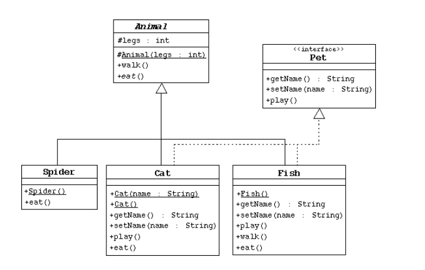

   
  <h1>simple-pet-program</h1>
   

## Table of Contents

- [Description](#description)
- [Minimum Requirements](#minimum-requirements)

## Description

My friend gave me a challenge to implement a program in Java. This simple program is meant to review OOP, data types, collections, & exception handling in Java. This repository contains the answer to the challenge.

## Minimum Requirements

- The program should include at least classes with attributes & methods as shown in the diagram above.
- It should also have a User class that can be extended into more specific user types.
- Each user can have pets, with a maximum of 2 pets per user.
- If a user already has 2 pets, the program should throw a `CantHaveMoreThanTwoException` when trying to set the user as the owner of the pet.
